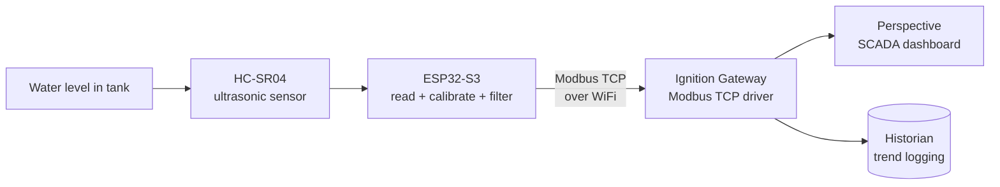

# Tank Level SCADA Monitoring System

A benchtop IIoT level monitoring system that takes a raw ultrasonic sensor reading and gets it all the way onto a live industrial SCADA dashboard, using the same protocols and design standards found in real process plants.

An ESP32 reads water level from an ultrasonic sensor, publishes it over **Modbus TCP**, and streams it to a live **Ignition (Perspective)** dashboard built to **ISA-101 high-performance HMI** principles, with historian trending.

> **Project status: Phase 1 (Monitoring) complete.** Phase 2 (closed-loop control) is in development. See the [Roadmap](#roadmap) below.

---

## What it does

The system continuously measures the liquid level in a tank and presents it on a real-time operator dashboard. The level reading drives a live tank graphic, a numeric readout, a sensor-health status indicator, and a historian trend that logs every reading for later analysis. When the level crosses a configurable high threshold, the tank graphic changes colour to draw operator attention, following ISA-101 design intent (colour reserved for abnormal states only).

---

## Architecture



Data flow in words: physical water level -> ultrasonic sensor -> ESP32 (reads, calibrates, filters) -> Modbus TCP over WiFi -> Ignition Gateway -> live Perspective dashboard + historian.

---

## Hardware

| Component | Detail |
|---|---|
| Microcontroller | ESP32-S3 DevKitC-1 |
| Level sensor | HC-SR04 ultrasonic sensor |
| Tank | Clear cylinder, ~25 cm tall, ~8 cm diameter |
| Mounting | Sensor mounted on a cap, pointing straight down at the water surface |
| Breadboard + jumpers | Standard prototyping |

### Wiring

The HC-SR04 runs at 5 V, so its Echo pin outputs 5 V, which is too high for the ESP32's 3.3 V GPIO. A simple two-resistor voltage divider drops Echo to a safe level. **The divider protects the ESP32 and must stay in place.**

```
HC-SR04 VCC   ->  ESP32 5V (VIN)
HC-SR04 GND   ->  ESP32 GND
HC-SR04 Trig  ->  ESP32 GPIO17        (direct, 3.3V trigger is fine)
HC-SR04 Echo  ->  1k ohm  ->  GPIO16 junction
GPIO16 junction  ->  1k ohm  ->  GND  (divider gives ~2.5V at GPIO16)
```

---

## Firmware

Written in the Arduino IDE using **Arduino Core 3.x** for the ESP32.

**Library:** `modbus-esp8266` by Alexander Emelianov (works on ESP32 despite the name). Include with `#include <ModbusIP_ESP8266.h>`. Repo: https://github.com/emelianov/modbus-esp8266

The firmware:
1. Triggers the ultrasonic sensor and measures echo time to get distance.
2. Converts distance to a level reading using the calibration constants below.
3. Applies an exponential moving average (EMA) filter to smooth noise.
4. Serves the result as a Modbus TCP server on port **502**.

### Calibration

These constants are specific to this rig and were measured directly. Re-measure for your own tank.

```cpp
#define EMPTY_DIST_CM   21.5   // sensor-to-water distance when tank is empty
#define FULL_DIST_CM     3.3   // sensor-to-water distance when tank is full
#define TANK_RANGE_CM   18.2   // usable measurement span (EMPTY - FULL)
#define ALPHA            0.2   // EMA filter smoothing factor
```

> **Note on the dead zone:** the HC-SR04 cannot reliably measure objects closer than ~2-3 cm. The sensor is mounted with enough headroom that the full water level always stays outside this dead zone.

### Modbus register map

| Register | Meaning | Notes |
|---|---|---|
| `HR0` | Level (cm x 10) | Sent as an integer. Apply a **0.1 scale** in Ignition to recover cm. |
| `HR1` | Sensor status | `1` = good echo, `0` = no echo / sensor fault |

The level is multiplied by 10 before sending because Modbus holding registers carry integers; scaling it back down in Ignition preserves one decimal place of precision.

---

## Ignition configuration

Built on **Ignition Maker Edition 8.3**.

> **Why Modbus TCP and not MQTT?** Ignition Maker Edition does not support the Cirrus Link MQTT modules, but it includes the Modbus TCP driver natively. Modbus TCP was therefore the correct transport for this edition. MQTT could be added later via a full Ignition trial.

### Device connection
- Driver: **Modbus TCP**
- Host: the ESP32's IP address (assigned by DHCP)
- Port: **502**

### Address mapping
| Field | Value |
|---|---|
| Prefix | `HR` |
| Start | `0` |
| End | `1` |
| Unit ID | `1` |
| Modbus type | Holding Register |
| Modbus Address | `1` |

> **Gotcha:** the Modbus Address field is 1-based. Setting it to `1` (not `0`) was the fix for a `Bad_NotFound` quality on the tags.

### Tags
| Tag | Source | Config |
|---|---|---|
| `LT-101` | `HR0` | Linear scale (raw -> cm, 0.1 factor), units `cm`, history enabled |
| `ST-101` | `HR1` | Integer, sensor health. **OPC Server must be set** (a blank OPC Server causes a config error). |

### Dashboard
A two-panel Perspective view following ISA-101 high-performance HMI principles:
- **Process Graphic panel:** cylindrical tank (blue normal / amber above the high threshold), large numeric cm readout, sensor online/offline status.
- **Historian Trend panel:** Power Chart bound to `LT-101` history, y-axis locked to the tank range.
- **Header:** title, live clock, and a Modbus connection status indicator.

---

## Repository contents

```
tank-level-scada/
|-- README.md
|-- firmware/
|   |-- tank_level_bringup.ino      # calibrated sensor read, serial output
|   |-- tank_level_modbus.ino       # Modbus TCP server (main firmware)
|-- docs/
    |-- dashboard.png               # live Perspective dashboard
    |-- physical_rig.png            # benchtop hardware
    |-- ignition_config/            # device + tag setup screenshots
```

> **Before you run the firmware:** open the `.ino` file and replace the WiFi placeholders with your own network details:
> ```cpp
> const char* WIFI_SSID     = "YOUR_SSID";
> const char* WIFI_PASSWORD = "YOUR_PASSWORD";
> ```
> The committed code contains placeholders only. **Never commit real WiFi credentials.**

---

## How to reproduce

1. Wire the HC-SR04 to the ESP32 as shown above (keep the Echo voltage divider).
2. Open `firmware/tank_level_modbus.ino` in the Arduino IDE (Core 3.x), install the `modbus-esp8266` library, and set your WiFi credentials.
3. Re-measure `EMPTY_DIST_CM` and `FULL_DIST_CM` for your own tank and update the constants.
4. Upload to the ESP32 and note the IP address it prints to the serial monitor.
5. In Ignition, add a Modbus TCP device pointing at that IP on port 502, configure the address mapping and tags as above, and build (or import) the Perspective view.

---

## Roadmap

**Phase 1 - Monitoring (complete)**
- [x] Calibrated ultrasonic level sensing with noise filtering
- [x] Modbus TCP server on the ESP32
- [x] Ignition device connection and scaled tags
- [x] ISA-101 dashboard with live tank graphic, status, and historian trend

**Phase 2 - Control (in development)**
- [ ] Two-way Modbus: server-commanded LED / buzzer alarm on high level (proves bidirectional comms)
- [ ] Closed-loop pump control (bang-bang, then PID) once a relay and pump are sourced
- [ ] Hardwired float-switch failsafe for overflow protection, independent of the network

**Longer term**
- Scale the level-control principles toward multiphase (oil/water) separator control, the direction this work is heading.

---

## Notes

- The hardware is a deliberately low-cost benchtop prototype. The point was to prove the software stack, the comms protocol, and the HMI logic before investing in industrial-grade instrumentation.
- AI was used as a coding assistant for firmware boilerplate. All calibration, integration, debugging, Ignition configuration, and HMI design were done hands-on.
