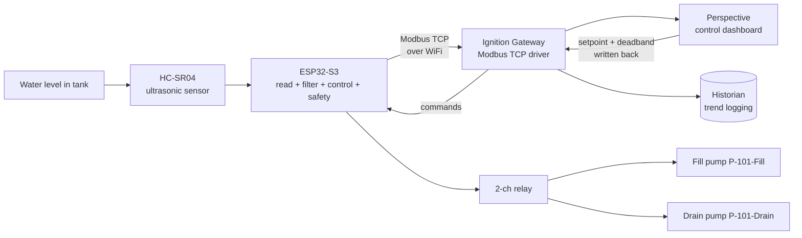

# Tank Level SCADA: Monitoring & Closed-Loop Control

A benchtop IIoT level control system that takes a raw ultrasonic sensor reading and gets it all the way onto a live industrial SCADA dashboard with operator-adjustable control, using the same protocols and design standards found in real process plants.

An ESP32 reads water level from an ultrasonic sensor, runs a closed-loop control algorithm that drives two pumps through a relay, publishes everything over **Modbus TCP**, and streams it to a live **Ignition (Perspective)** dashboard built to **ISA-101 high-performance HMI** principles, with historian trending and operator-adjustable setpoints.

> **Project status: Phase 1 (Monitoring) and Phase 2 (Closed-Loop Control) both complete and running on hardware.** Live closed-loop control verified with real water moving between two tanks. See the [Roadmap](#roadmap) below.

---

## What it does

### Phase 1: Monitoring

The system continuously measures the liquid level in a tank and presents it on a real-time operator dashboard. The level reading drives a live tank graphic, a numeric readout, a sensor-health status indicator, and a historian trend that logs every reading for later analysis. When the level crosses a configurable high threshold, the tank graphic changes colour to draw operator attention, following ISA-101 design intent (colour reserved for abnormal states only).

### Phase 2: Closed-Loop Control

The system **actively maintains** the water level at an operator-chosen setpoint instead of just watching it. Two submersible pumps (one fill, one drain) are switched by a relay using **two-position (bang-bang) control with a deadband**. The operator types a target level on the dashboard, the command travels back to the ESP32 over Modbus, and the controller drives the physical process to hold that level. Water is cycled between a main tank and a reservoir entirely under autonomous control.

This is the difference between **telemetry** (watching) and **SCADA proper** (Supervisory Control And Data Acquisition, where the system acts on what it measures).

```
Level below lower deadband  ->  fill pump ON,  drain pump OFF   (rising)
Level above upper deadband  ->  fill pump OFF, drain pump ON    (falling)
Level inside the deadband   ->  both pumps OFF                  (holding)
```

> **Why bang-bang and not PID?** Two-position control is a legitimate, widely used industrial strategy for level, HVAC, and boiler systems. It maps cleanly onto a relay (an on/off output) with no variable-speed pump hardware. A PID upgrade with MOSFET PWM is planned as Phase 3.

<!-- Add real-water screenshots here once captured:


-->


---

## Architecture



Data flow in words: physical water level -> ultrasonic sensor -> ESP32 (reads, calibrates, filters, runs control + safety logic) -> Modbus TCP over WiFi -> Ignition Gateway -> live Perspective dashboard + historian. The dashboard writes the setpoint and deadband **back** to the ESP32, which closes the loop.

---

## Hardware

| Component | Detail |
|---|---|
| Microcontroller | ESP32-S3 DevKitC-1 |
| Level sensor | HC-SR04 ultrasonic sensor |
| Main tank (TK-101) | Clear cylinder, ~16 cm tall, ~11 cm diameter |
| Reservoir (TK-102) | Secondary container, no modifications required |
| Fill pump (P-101-Fill) | 5V DC submersible, sits in the reservoir |
| Drain pump (P-101-Drain) | 5V DC submersible, sits in the main tank |
| Relay | 2-channel 5V module (active-low), optocoupler isolation |
| Flyback diodes | 1N4007, one across each pump (cathode to the +5V side) |
| Breadboard + jumpers | Standard prototyping |

### Wiring: Phase 1 (sensor)

The HC-SR04 runs at 5 V, so its Echo pin outputs 5 V, too high for the ESP32's 3.3 V GPIO. A two-resistor voltage divider drops Echo to a safe level. **The divider protects the ESP32 and must stay in place.**

```
HC-SR04 VCC   ->  ESP32 5V (VIN)
HC-SR04 GND   ->  ESP32 GND
HC-SR04 Trig  ->  ESP32 GPIO17        (direct, 3.3V trigger is fine)
HC-SR04 Echo  ->  1k ohm  ->  GPIO16 junction
GPIO16 junction  ->  1k ohm  ->  GND  (divider gives ~2.5V at GPIO16)
```

### Wiring: Phase 2 (relay + pumps)

```
Relay IN (fill)   ->  ESP32 GPIO8
Relay IN (drain)  ->  ESP32 GPIO18
Relay VCC         ->  5V
Relay GND         ->  GND (common with ESP32 GND)

Fill pump:  +5V supply -> Relay CH COM, Relay CH NO -> pump red (+), pump black -> GND
Drain pump: +5V supply -> Relay CH COM, Relay CH NO -> pump red (+), pump black -> GND
1N4007 across each pump: banded (cathode) end to the pump + terminal
```

> **The relay must be in series with the pump, not on the power rails.** Power enters at COM and reaches the pump only when the relay closes COM to NO. Wiring the pump directly to +5V and GND bypasses the relay and the pump runs permanently.

> **Separate supply:** pumps are powered from a supply separate from the ESP32 board, with all grounds tied together.

> **Active-low relay:** this board energizes on a LOW signal. The firmware writes `LOW` for ON and `HIGH` for OFF in `setFillPump()` / `setDrainPump()`, and drives both pins `HIGH` at boot so the pumps start off. If your board is active-high, invert these.

> **GPIO8 is a strapping pin.** It works fine as a relay output but can block firmware uploads. If an upload fails with "no serial data" or "invalid head of packet", pull the relay wire off GPIO8, flash, then reconnect it. Using GPIO4 and GPIO5 instead avoids this entirely if you are starting fresh.

---

## Firmware

Written in the Arduino IDE using **Arduino Core 3.x** for the ESP32.

**Library:** `modbus-esp8266` by Alexander Emelianov (works on ESP32 despite the name). Include with `#include <ModbusIP_ESP8266.h>`. Repo: https://github.com/emelianov/modbus-esp8266

The firmware:
1. Triggers the ultrasonic sensor, takes a **median of 5 readings**, converts to distance.
2. Converts distance to a level using the calibration constants below, then applies an **EMA filter** to smooth noise.
3. Reads the operator setpoint and deadband from Modbus and runs **bang-bang control** on the two pumps.
4. Enforces a **safety layer** with hard-coded fault precedence (see below).
5. Serves everything as a Modbus TCP server on port **502**.

### Calibration

These constants are specific to this rig and were measured directly on the 16 cm tank. Re-measure for your own tank.

```cpp
const float EMPTY_DIST_CM = 16.0;   // sensor-to-water distance, tank empty
const float FULL_DIST_CM  = 4.5;    // sensor-to-water distance, tank full (dead-zone safe)
const float TANK_RANGE_CM = 11.5;   // usable span (EMPTY - FULL)
const float ALPHA         = 0.2;    // EMA filter smoothing factor
```

> **Note on the dead zone:** the HC-SR04 cannot reliably measure objects closer than ~2-3 cm. The full level is kept at least ~4 cm below the sensor so the water surface never enters this dead zone.

### Alarm and safety thresholds

```cpp
const float HIGH_ALARM_CM = 10.0;   // high level alarm (fires above normal operating range)
const float LOW_ALARM_CM  = 1.5;    // low level alarm
const float OVERFLOW_CM   = 11.0;   // forced-drain trip, with hysteresis
```

### Safety layer (hard fault precedence)

Faults are resolved in a single `if / else-if` chain, so a higher-priority fault structurally blocks the logic below it:

1. **Sensor fail** (consecutive missed echoes) -> both pumps OFF. Overflow logic cannot run on stale data.
2. **Dry-run latch** (pump running past the timeout) -> both pumps OFF, latched until the operator writes a new setpoint.
3. **Overflow** (level above `OVERFLOW_CM`, with hysteresis: clears below `HIGH_ALARM_CM`) -> drain FORCED ON regardless of setpoint.
4. Otherwise -> normal bang-bang control.

All four paths were verified on hardware, including the precedence stack (a sensor fault correctly overrides an active overflow).

### Modbus register map

| Register | Ignition addr | Direction | Meaning |
|---|---|---|---|
| `HR0`  | 1  | ESP32 -> SCADA | Level (cm x 10). Apply **0.1 scale** in Ignition. |
| `HR1`  | 2  | ESP32 -> SCADA | Sensor status (`1` good echo, `0` fault) |
| `HR2`  | 3  | ESP32 -> SCADA | Fill pump state (`1` running, `0` stopped) |
| `HR3`  | 4  | ESP32 -> SCADA | Drain pump state |
| `HR4`  | 5  | ESP32 -> SCADA | High level alarm |
| `HR5`  | 6  | ESP32 -> SCADA | Low level alarm |
| `HR6`  | 7  | ESP32 -> SCADA | Fault code (`0` none, `1` sensor, `2` overflow, `3` dry-run latch) |
| `HR10` | 11 | SCADA -> ESP32 | Setpoint (cm x 10), clamped and written back |
| `HR11` | 12 | SCADA -> ESP32 | Deadband (cm x 10), clamped 0.3 to 5.0 cm |

> **Two address bases:** the firmware uses 0-based offsets (`HR0`), Ignition addresses them 1-based (`HR0` -> address 1). `HR7` to `HR9` are reserved so a single Modbus block read never lands on an unallocated register.

### Simulate mode

Set `SIMULATE_LEVEL = true` to exercise the **entire control loop and every safety interlock with no hardware**. In the Serial Monitor: type a positive number to set the simulated level, a negative number to simulate a sensor failure.

---

## Ignition configuration

Built on **Ignition Maker Edition 8.3**.

> **Why Modbus TCP and not MQTT?** Ignition Maker Edition does not support the Cirrus Link MQTT modules, but includes the Modbus TCP driver natively. Modbus TCP was therefore the correct transport for this edition.

### Device connection
- Driver: **Modbus TCP**
- Host: the ESP32's IP address (assigned by DHCP)
- Port: **502**

### Address mapping
| Field | Value |
|---|---|
| Prefix | `HR` |
| Start | `0` |
| End | `11` |
| Unit ID | `1` |
| Modbus type | Holding Register |
| Modbus Address | `1` |

> **Gotcha:** the Modbus Address field is 1-based. Setting it to `1` (not `0`) was the fix for a `Bad_NotFound` quality on the tags.

### Tags
| Tag | Source | Config |
|---|---|---|
| `LT-101` | `HR0` | **Float**, linear 0.1 scale -> cm, history enabled |
| `ST-101` | `HR1` | Integer, sensor health |
| `P-101-Fill` | `HR2` | Integer, fill pump state |
| `P-101-Drain` | `HR3` | Integer, drain pump state |
| `AL-HI` | `HR4` | Integer, high level alarm |
| `AL-LO` | `HR5` | Integer, low level alarm |
| `FT-FAULT` | `HR6` | Integer, fault code |
| `SP-101` | `HR10` | **Float**, linear 0.1, bidirectional, history enabled |
| `DB-101` | `HR11` | **Float**, linear 0.1, bidirectional |

> **Float, not Integer:** tags carrying decimals via the x10 convention must be **Float**. Ignition silently truncates a scaled Integer (0.3 becomes 0) with no error.

> **Bidirectional bindings:** writable fields (setpoint, deadband) need the Bidirectional checkbox explicitly enabled in the binding's Options row, not just a writable tag.

### Dashboard

A three-column Perspective view following ISA-101 high-performance HMI principles:

- **Alarm banner (full width):** LOW LEVEL, HIGH LEVEL, and FAULT slots that glow amber (level) or red (fault) only when active. The FAULT slot names the fault: `FAULT - SENSOR`, `FAULT - OVERFLOW`, `FAULT - DRY-RUN LATCH`.
- **Process graphic:** a live P&ID-style mimic of TK-101 and TK-102 with fill/drain lines and ISA pump symbols. Pipe segments animate cyan when their pump runs. The tank carries a live setpoint line and a faint deadband band that track the operator's setpoint.
- **Control faceplate:** large PV readout, operator setpoint entry, deviation (amber outside the deadband), a state word (`FILLING` / `DRAINING` / `HOLDING` / `FAULT`), deadband entry, and per-pump status rows.
- **Historian trend:** Power Chart with two pens, `LT-101` (cyan, solid) and `SP-101` (amber, dashed, stepped). The setpoint line and deadband band scale from a single `tankRange` view property.

---

## Recalibration (on tank change)

With the sensor mounted in its final position, measure: `EMPTY_DIST_CM` (sensor to bottom, empty), `FULL_DIST_CM` (sensor to surface at full, leaving ~4 cm dead-zone headroom), and `TANK_RANGE_CM = EMPTY - FULL`. Update those three firmware constants, revisit `HIGH_ALARM_CM` / `LOW_ALARM_CM` / `OVERFLOW_CM`, and set the Ignition view property `tankRange` to the new range so the setpoint line and deadband band rescale.

---

## Repository contents

```
Tank-Level-SCADA/
|-- README.md
|-- firmware/
|   |-- tank_level_bringup.ino      # Phase 1: calibrated sensor read, serial output
|   |-- tank_level_modbus.ino       # Phase 1: Modbus TCP monitoring server
|   |-- tank_level_control.ino      # Phase 2: closed-loop control + safety layer
|-- docs/
    |-- dashboard_phase2.png        # live control dashboard
    |-- dashboard_fault.png         # fault state
    |-- ignition_config/            # device + tag setup screenshots
```

> **Before you run the firmware:** open the `.ino` and replace the WiFi placeholders.
> ```cpp
> const char* WIFI_SSID = "YOUR_SSID";
> const char* WIFI_PASS = "YOUR_PASSWORD";
> ```
> The committed code contains placeholders only. **Never commit real WiFi credentials.**

---

## How to reproduce

1. Wire the HC-SR04 to the ESP32 as shown above (keep the Echo voltage divider). For Phase 2, add the relay and pumps, with each pump in series through its relay channel (COM/NO).
2. Open the firmware in the Arduino IDE (Core 3.x), install the `modbus-esp8266` library, and set your WiFi credentials.
3. With `SIMULATE_LEVEL = true`, verify the control loop and safety logic in the Serial Monitor before connecting any hardware.
4. Mount the sensor in its final position, then measure and update `EMPTY_DIST_CM` and `FULL_DIST_CM` for your tank.
5. Upload, note the IP printed to serial, add a Modbus TCP device in Ignition pointing at that IP on port 502, configure the address mapping and tags above, and build the Perspective view.

---

## Roadmap

**Phase 1: Monitoring (complete)**
- [x] Calibrated ultrasonic level sensing with median + EMA filtering
- [x] Modbus TCP server on the ESP32
- [x] Ignition device connection and scaled tags
- [x] ISA-101 dashboard with live tank graphic, status, and historian trend

**Phase 2: Closed-Loop Control (complete, running on hardware)**
- [x] Two-way Modbus: operator writes setpoint and deadband from the dashboard
- [x] Bang-bang control with deadband via 2-channel relay
- [x] Safety layer: sensor-fail interlock, overflow-forced-drain with hysteresis, dry-run latch (all verified on hardware)
- [x] ISA-101 control dashboard: alarm banner, process mimic, control faceplate, dual-pen trend
- [x] Physical build: two pumps cycling real water between TK-101 and TK-102 under autonomous control
- [ ] Buzzer physical alarm annunciator

**Phase 3: Single-loop PID (planned)**
- [ ] Variable-speed pump via MOSFET PWM
- [ ] PID with anti-windup and bumpless manual/auto transfer
- [ ] ISA-18.2 alarm management: priorities, acknowledgment, journal, time-in-alarm KPIs

**Phase 4: Cascade control (planned)**
- [ ] YF-S201 flow sensor
- [ ] Cascade structure: outer level loop sets an inner flow loop setpoint

**Longer term**
- Scale the level-control principles toward multiphase (oil/water) separator control, the direction this work is heading.

---

## Notes

- The hardware is a deliberately low-cost benchtop prototype. The point was to prove the software stack, the comms protocol, the control logic, and the HMI design before investing in industrial-grade instrumentation. The architecture, protocols, and engineering principles are the real thing.
- AI was used as a coding and debugging assistant. All calibration, integration, Ignition configuration, HMI design, and hardware decisions were made by me.
