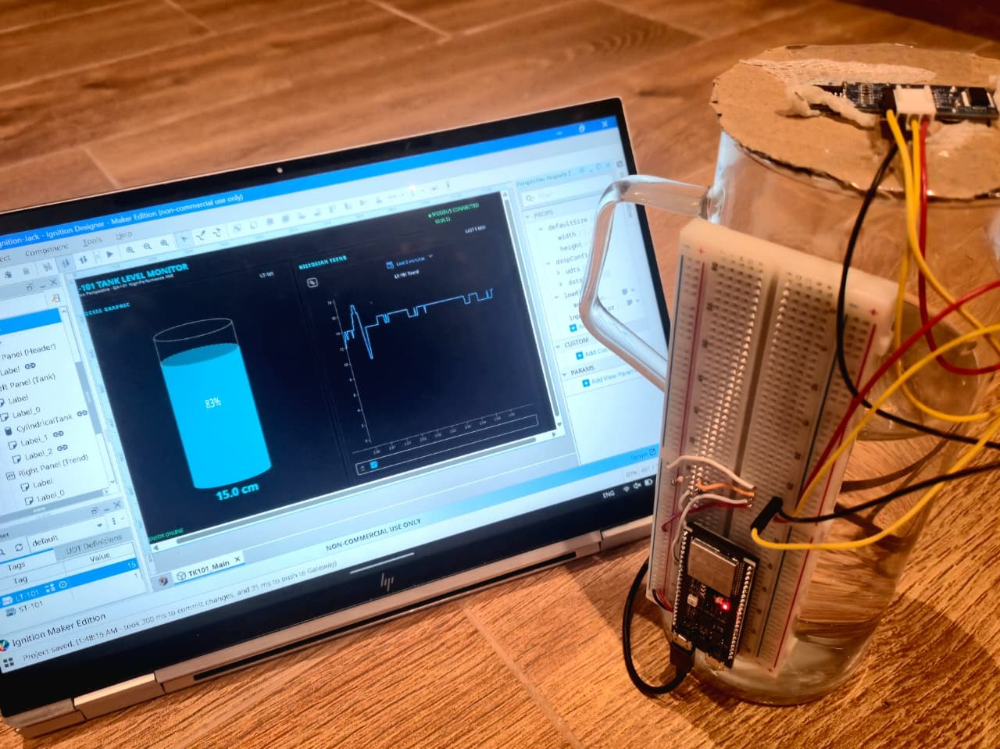
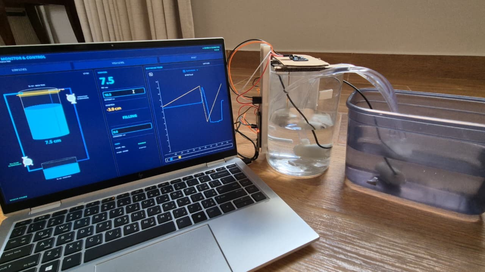
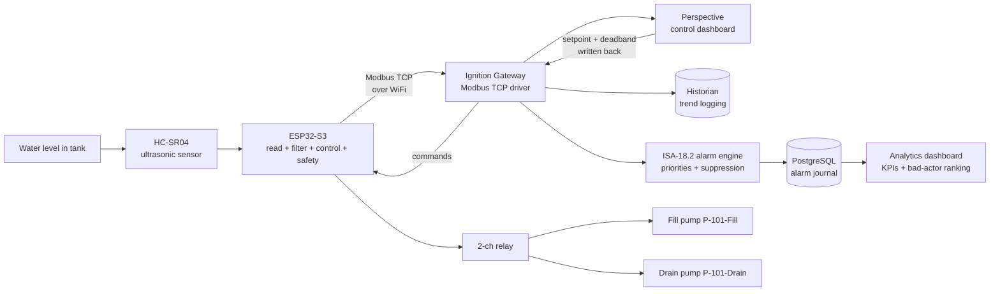

[Phase3readME.md](https://github.com/user-attachments/files/29318246/Phase3readME.md)
# Tank Level SCADA: Monitoring, Closed-Loop Control & ISA-18.2 Alarm Management

A benchtop IIoT level control system that takes a raw ultrasonic sensor reading and gets it all the way onto a live industrial SCADA dashboard with operator-adjustable control, a rationalised ISA-18.2 alarm system, and a SQL-backed analytics layer, using the same protocols and design standards found in real process plants.

An ESP32 reads water level from an ultrasonic sensor, runs a closed-loop control algorithm that drives two pumps through a relay, publishes everything over **Modbus TCP**, and streams it to a live **Ignition (Perspective)** dashboard built to **ISA-101 high-performance HMI** principles, with historian trending and operator-adjustable setpoints. On top of that sits a full **ISA-18.2 alarm management layer**: rationalised and prioritised alarms with suppression-by-design, a **PostgreSQL**-backed alarm journal, and a custom-built analytics dashboard computing real alarm-performance KPIs (bad-actor ranking, time-in-alarm) in SQL.

> **Project status: Phase 1 (Monitoring), Phase 2 (Closed-Loop Control), and Phase 3 (ISA-18.2 Alarm Management & Analytics) all complete and running on hardware.** Live closed-loop control verified with real water moving between two tanks, and the full alarm-management layer verified live (priorities, suppression, acknowledgment, RTN-UNACK state model) with alarm data journaled to PostgreSQL and surfaced through a custom analytics dashboard. See the [Roadmap](#roadmap) below.

---

## What it does

### Phase 1: Monitoring

The system continuously measures the liquid level in a tank and presents it on a real-time operator dashboard. The level reading drives a live tank graphic, a numeric readout, a sensor-health status indicator, and a historian trend that logs every reading for later analysis. When the level crosses a configurable high threshold, the tank graphic changes colour to draw operator attention, following ISA-101 design intent (colour reserved for abnormal states only).




### Phase 2: Closed-Loop Control

The system **actively maintains** the water level at an operator-chosen setpoint instead of just watching it. Two submersible pumps (one fill, one drain) are switched by a relay using **two-position (bang-bang) control with a deadband**. The operator types a target level on the dashboard, the command travels back to the ESP32 over Modbus, and the controller drives the physical process to hold that level. Water is cycled between a main tank and a reservoir entirely under autonomous control.

This is the difference between **telemetry** (watching) and **SCADA proper** (Supervisory Control And Data Acquisition, where the system acts on what it measures).

```
Level below lower deadband  ->  fill pump ON,  drain pump OFF   (rising)
Level above upper deadband  ->  fill pump OFF, drain pump ON    (falling)
Level inside the deadband   ->  both pumps OFF                  (holding)
```

> **Why bang-bang and not PID?** Two-position control is a legitimate, widely used industrial strategy for level, HVAC, and boiler systems. It maps cleanly onto a relay (an on/off output) with no variable-speed pump hardware. A PID upgrade with MOSFET PWM is planned as a later phase.




### Phase 3: ISA-18.2 Alarm Management & Analytics

Phases 1 and 2 prove the system can watch the process and control it. Phase 3 answers a different question: when something goes wrong, how does the system tell the operator, in what order, and how do you measure whether the alarm system itself is healthy? That is the domain of **ANSI/ISA-18.2-2016**, the standard for management of alarm systems in the process industries, and this phase implements it properly rather than just turning a label red when a number crosses a line.

The work splits into three layers:

- **A rationalised alarm set.** Five alarms (Overflow, Sensor Fault, Dry-Run Latch, Level High, Level Low), each justified against the standard, prioritised by consequence and response time, with a defined operator action. This is backed by a written **alarm philosophy document and master alarm database** (the ISA-18.2 governing artifacts), version-controlled in this repo.
- **A live alarm system with a real state model.** Priorities, acknowledgment, deadbands to stop chatter, **suppression-by-design** (a sensor fault suppresses the level alarms because the reading is untrusted), and the full state model including return-to-normal-unacknowledged (RTN-UNACK), so a transient alarm that clears before anyone sees it is never silently lost.
- **A SQL-backed analytics layer.** Every alarm event is journaled to **PostgreSQL**, and a custom-built analytics dashboard computes genuine ISA-18.2 performance metrics directly in SQL: total activations, bad-actor ranking (which alarm fires most), and average time-in-alarm.

The conceptual spine of the design is the split between the firmware safety layer and the supervisory alarm layer. The firmware interlocks (overflow forced-drain, sensor-fault pump halt, dry-run latch) are physical protective functions that act on the process and cannot depend on Ignition being connected, so they stay frozen in the controller. The ISA-18.2 layer is supervisory: it presents, prioritises, acknowledges, logs, and analyses alarms for the operator, and it lives entirely in Ignition. That is the Basic Process Control System versus Safety Instrumented System distinction applied correctly, and the practical consequence is that the entire alarm layer was built with **zero firmware changes**, configured from tags (`LT-101`, `FT-FAULT`) that already stream.


> **The full alarm philosophy and master alarm database** (priority matrix, suppression policy, state model, performance targets, lifecycle coverage map) is included as a separate document in this repo. It is the governing artifact every alarm is rationalised against, and it is the piece placed under management of change.

---

## Architecture



Data flow in words: physical water level -> ultrasonic sensor -> ESP32 (reads, calibrates, filters, runs control + safety logic) -> Modbus TCP over WiFi -> Ignition Gateway -> live Perspective dashboard + historian. The dashboard writes the setpoint and deadband **back** to the ESP32, which closes the loop. In parallel, Ignition's alarm engine evaluates the streaming tags against the rationalised alarm set, journals every event to PostgreSQL, and feeds a custom analytics dashboard that computes alarm-performance KPIs in SQL.

---

## Hardware

| Component | Detail |
|---|---|
| Microcontroller | ESP32-S3 DevKitC-1 |
| Level sensor | HC-SR04 ultrasonic sensor |
| Main tank (TK-101) | Clear cylinder, ~16 cm tall, ~11 cm diameter |
| Reservoir (TK-102) | Secondary container, no modifications required |
| Fill pump (P-101-Fill) | 5V DC submersible, sits in the reservoir |
| Drain pump (P-101-Drain) | 5V DC submersible, sits in the main tank |
| Relay | 2-channel 5V module (active-low), optocoupler isolation |
| Flyback diodes | 1N4007, one across each pump (cathode to the +5V side) |
| Breadboard + jumpers | Standard prototyping |

### Wiring: Phase 1 (sensor)

The HC-SR04 runs at 5 V, so its Echo pin outputs 5 V, too high for the ESP32's 3.3 V GPIO. A two-resistor voltage divider drops Echo to a safe level. **The divider protects the ESP32 and must stay in place.**

```
HC-SR04 VCC   ->  ESP32 5V (VIN)
HC-SR04 GND   ->  ESP32 GND
HC-SR04 Trig  ->  ESP32 GPIO17        (direct, 3.3V trigger is fine)
HC-SR04 Echo  ->  1k ohm  ->  GPIO16 junction
GPIO16 junction  ->  1k ohm  ->  GND  (divider gives ~2.5V at GPIO16)
```

### Wiring: Phase 2 (relay + pumps)

```
Relay IN (fill)   ->  ESP32 GPIO8
Relay IN (drain)  ->  ESP32 GPIO18
Relay VCC         ->  5V
Relay GND         ->  GND (common with ESP32 GND)

Fill pump:  +5V supply -> Relay CH COM, Relay CH NO -> pump red (+), pump black -> GND
Drain pump: +5V supply -> Relay CH COM, Relay CH NO -> pump red (+), pump black -> GND
1N4007 across each pump: banded (cathode) end to the pump + terminal
```

> **The relay must be in series with the pump, not on the power rails.** Power enters at COM and reaches the pump only when the relay closes COM to NO. Wiring the pump directly to +5V and GND bypasses the relay and the pump runs permanently.

> **Separate supply:** pumps are powered from a supply separate from the ESP32 board, with all grounds tied together.

> **Active-low relay:** this board energizes on a LOW signal. The firmware writes `LOW` for ON and `HIGH` for OFF in `setFillPump()` / `setDrainPump()`, and drives both pins `HIGH` at boot so the pumps start off. If your board is active-high, invert these.

> **GPIO8 is a strapping pin.** It works fine as a relay output but can block firmware uploads. If an upload fails with "no serial data" or "invalid head of packet", pull the relay wire off GPIO8, flash, then reconnect it. Using GPIO4 and GPIO5 instead avoids this entirely if you are starting fresh.

---

## Firmware

Written in the Arduino IDE using **Arduino Core 3.x** for the ESP32.

**Library:** `modbus-esp8266` by Alexander Emelianov (works on ESP32 despite the name). Include with `#include <ModbusIP_ESP8266.h>`. Repo: https://github.com/emelianov/modbus-esp8266

The firmware:
1. Triggers the ultrasonic sensor, takes a **median of 5 readings**, converts to distance.
2. Converts distance to a level using the calibration constants below, then applies an **EMA filter** to smooth noise.
3. Reads the operator setpoint and deadband from Modbus and runs **bang-bang control** on the two pumps.
4. Enforces a **safety layer** with hard-coded fault precedence (see below).
5. Serves everything as a Modbus TCP server on port **502**.

### Calibration

These constants are specific to this rig and were measured directly on the 16 cm tank. Re-measure for your own tank.

```cpp
const float EMPTY_DIST_CM = 16.0;   // sensor-to-water distance, tank empty
const float FULL_DIST_CM  = 4.5;    // sensor-to-water distance, tank full (dead-zone safe)
const float TANK_RANGE_CM = 11.5;   // usable span (EMPTY - FULL)
const float ALPHA         = 0.2;    // EMA filter smoothing factor
```

> **Note on the dead zone:** the HC-SR04 cannot reliably measure objects closer than ~2-3 cm. The full level is kept at least ~4 cm below the sensor so the water surface never enters this dead zone.

### Alarm and safety thresholds

```cpp
const float HIGH_ALARM_CM = 10.0;   // high level alarm (fires above normal operating range)
const float LOW_ALARM_CM  = 1.5;    // low level alarm
const float OVERFLOW_CM   = 11.0;   // forced-drain trip, with hysteresis
```

### Safety layer (hard fault precedence)

Faults are resolved in a single `if / else-if` chain, so a higher-priority fault structurally blocks the logic below it:

1. **Sensor fail** (consecutive missed echoes) -> both pumps OFF. Overflow logic cannot run on stale data.
2. **Dry-run latch** (pump running past the timeout) -> both pumps OFF, latched until the operator writes a new setpoint.
3. **Overflow** (level above `OVERFLOW_CM`, with hysteresis: clears below `HIGH_ALARM_CM`) -> drain FORCED ON regardless of setpoint.
4. Otherwise -> normal bang-bang control.

All four paths were verified on hardware, including the precedence stack (a sensor fault correctly overrides an active overflow).

### Modbus register map

| Register | Ignition addr | Direction | Meaning |
|---|---|---|---|
| `HR0`  | 1  | ESP32 -> SCADA | Level (cm x 10). Apply **0.1 scale** in Ignition. |
| `HR1`  | 2  | ESP32 -> SCADA | Sensor status (`1` good echo, `0` fault) |
| `HR2`  | 3  | ESP32 -> SCADA | Fill pump state (`1` running, `0` stopped) |
| `HR3`  | 4  | ESP32 -> SCADA | Drain pump state |
| `HR4`  | 5  | ESP32 -> SCADA | High level alarm |
| `HR5`  | 6  | ESP32 -> SCADA | Low level alarm |
| `HR6`  | 7  | ESP32 -> SCADA | Fault code (`0` none, `1` sensor, `2` overflow, `3` dry-run latch) |
| `HR10` | 11 | SCADA -> ESP32 | Setpoint (cm x 10), clamped and written back |
| `HR11` | 12 | SCADA -> ESP32 | Deadband (cm x 10), clamped 0.3 to 5.0 cm |

> **Two address bases:** the firmware uses 0-based offsets (`HR0`), Ignition addresses them 1-based (`HR0` -> address 1). `HR7` to `HR9` are reserved so a single Modbus block read never lands on an unallocated register.

### Simulate mode

Set `SIMULATE_LEVEL = true` to exercise the **entire control loop and every safety interlock with no hardware**. In the Serial Monitor: type a positive number to set the simulated level, a negative number to simulate a sensor failure.

---

## Ignition configuration

Phases 1 and 2 were built on **Ignition Maker Edition 8.3**. Phase 3 required moving to an **Ignition educational license** (see the [Phase 3 section](#isa-182-alarm-management--analytics-phase-3) for why).

> **Why Modbus TCP and not MQTT?** Ignition Maker Edition does not support the Cirrus Link MQTT modules, but includes the Modbus TCP driver natively. Modbus TCP was therefore the correct transport for Phases 1 and 2, and it remains the transport in use. (The educational license used from Phase 3 onward does unlock the MQTT modules, so a Sparkplug re-architecture is now possible as future work, but the working system still runs on Modbus TCP.)

### Device connection
- Driver: **Modbus TCP**
- Host: the ESP32's IP address (assigned by DHCP)
- Port: **502**

### Address mapping
| Field | Value |
|---|---|
| Prefix | `HR` |
| Start | `0` |
| End | `11` |
| Unit ID | `1` |
| Modbus type | Holding Register |
| Modbus Address | `1` |

> **Gotcha:** the Modbus Address field is 1-based. Setting it to `1` (not `0`) was the fix for a `Bad_NotFound` quality on the tags.

### Tags
| Tag | Source | Config |
|---|---|---|
| `LT-101` | `HR0` | **Float**, linear 0.1 scale -> cm, history enabled |
| `ST-101` | `HR1` | Integer, sensor health |
| `P-101-Fill` | `HR2` | Integer, fill pump state |
| `P-101-Drain` | `HR3` | Integer, drain pump state |
| `AL-HI` | `HR4` | Integer, high level alarm |
| `AL-LO` | `HR5` | Integer, low level alarm |
| `FT-FAULT` | `HR6` | Integer, fault code |
| `SP-101` | `HR10` | **Float**, linear 0.1, bidirectional, history enabled |
| `DB-101` | `HR11` | **Float**, linear 0.1, bidirectional |

> **Float, not Integer:** tags carrying decimals via the x10 convention must be **Float**. Ignition silently truncates a scaled Integer (0.3 becomes 0) with no error.

> **Bidirectional bindings:** writable fields (setpoint, deadband) need the Bidirectional checkbox explicitly enabled in the binding's Options row, not just a writable tag.

### Dashboard

A three-column Perspective view following ISA-101 high-performance HMI principles:

- **Alarm banner (full width):** LOW LEVEL, HIGH LEVEL, and FAULT slots that glow amber (level) or red (fault) only when active. The FAULT slot names the fault: `FAULT - SENSOR`, `FAULT - OVERFLOW`, `FAULT - DRY-RUN LATCH`.
- **Process graphic:** a live P&ID-style mimic of TK-101 and TK-102 with fill/drain lines and ISA pump symbols. Pipe segments animate cyan when their pump runs. The tank carries a live setpoint line and a faint deadband band that track the operator's setpoint.
- **Control faceplate:** large PV readout, operator setpoint entry, deviation (amber outside the deadband), a state word (`FILLING` / `DRAINING` / `HOLDING` / `FAULT`), deadband entry, and per-pump status rows.
- **Historian trend:** Power Chart with two pens, `LT-101` (cyan, solid) and `SP-101` (amber, dashed, stepped). The setpoint line and deadband band scale from a single `tankRange` view property.

---

## ISA-18.2 Alarm Management & Analytics (Phase 3)

This is the supervisory alarm layer described in the [Phase 3 overview](#phase-3-isa-182-alarm-management--analytics) above, documented in full. It is built entirely in Ignition on top of the streaming tags, with no firmware changes.

### Why the educational license

Phases 1 and 2 ran on Maker Edition, which has no database module. The ISA-18.2 alarm journal and the SQL analytics that sit on top of it both require a database connection, which Maker cannot provide. Phase 3 therefore moved to an **Ignition educational license**, which unlocks the full module set (database/SQL, Reporting, Alarm Notification, the Cirrus Link MQTT stack, full OPC UA, and more). The only modules Phase 3 actually depends on are the database connection (for the journal) and the Reporting module (for the formal performance report). The move was a deliberate decision made when the project's needs outgrew Maker's tier, not a default.

### The alarm set (rationalisation)

ISA-18.2 begins with rationalisation: every alarm justified, prioritised by consequence and time-to-respond, with one defined operator action. The five alarms:

| Alarm | Source | Condition | Priority | Consequence if ignored | Operator action |
|---|---|---|---|---|---|
| Overflow | `FT-FAULT` = 2 | Firmware-determined level > 11.0 cm | **Critical** | Tank spill (the separator carryover analogue) | Confirm drain is running, investigate cause |
| Sensor Fault | `FT-FAULT` = 1 | Sustained no-echo | **High** | Measurement lost, control running blind | Inspect HC-SR04 wiring and Echo line |
| Dry-Run Latch | `FT-FAULT` = 3 | Pump running past firmware timeout | **High** | Pump burnout | Check supply, write a setpoint to clear the latch |
| Level High | `LT-101` >= 10.0 cm | Early warning before overflow | **Medium** | Approaches overflow | Lower setpoint or check drain path |
| Level Low | `LT-101` <= 1.5 cm | Early warning before dry-run | **Medium** | Approaches dry-run | Raise setpoint or check supply |

The distribution is one Critical, two High, two Medium. **Level High and Overflow are a deliberate Hi/HiHi pair:** the Medium warning gives the operator runway, the Critical is the escalation. Same logic for Level Low ahead of the Dry-Run Latch.

**Source-of-truth split:** the three fault alarms are sourced from the firmware fault code (`FT-FAULT`), because the firmware is authoritative on safety states. Level High and Level Low are configured fresh in Ignition's analog alarm engine off `LT-101` (with deadbands), not from the crude Phase 2 `HR4`/`HR5` flags, so thresholds can be retuned without reflashing. No physical condition is alarmed from two sources at once.

### Suppression by design

When the level reading is untrusted, alarming on it is worse than not alarming. Two suppression rules, both implemented as Ignition alarm `Enabled` expressions keyed on the fault code:

- **While Sensor Fault is active, Level High and Level Low are suppressed** (the level data cannot be trusted). This is the supervisory mirror of the firmware's own precedence, where sensor-fail gates the overflow check. The same principle applied one layer up.
- **While Overflow is active, Level High is suppressed**, because it is the subsumed lower member of the Hi/HiHi pair and annunciating both adds noise without information.

Both rules were verified live: triggering a sensor fault made the active Level High alarm vanish from the status table (suppressed, not stacked), and it re-activated on its own the instant the fault cleared while the level was still high. That dynamic round-trip is the stronger proof than just seeing it suppress once.

### The state model (RTN-UNACK)

A naive alarm implementation makes an alarm disappear the moment its condition clears. ISA-18.2 requires the **return-to-normal-unacknowledged** state: an alarm that clears while still unacknowledged persists until the operator acknowledges it, so a transient event is never silently lost. Ignition's alarm engine handles this natively and the dashboard is built to show it, verified live on both a level alarm and a fault alarm.

### PostgreSQL alarm journal

Every alarm lifecycle event is written to **PostgreSQL 18** (local, `localhost:5432`, database `ignition`) via an Ignition alarm journal profile. Ignition auto-creates the `alarm_events` table on the first alarm; there is nothing to create by hand. The schema and encodings that matter for the analytics:

| Column | Meaning |
|---|---|
| `eventid` | UUID shared by the Active and Clear rows of one alarm occurrence (this is what makes time-in-alarm computable) |
| `source` | Fully qualified path, e.g. `prov:default:/tag:LT-101:/alm:Level High` |
| `priority` | Integer: **4 = Critical, 3 = High, 2 = Medium** |
| `eventtype` | Integer: **0 = Active, 1 = Clear, 2 = Acknowledge** |
| `eventtime` | Event timestamp |

The journal is an **immutable event log**, not a state table: one alarm occurrence produces a permanent Active row and a separate permanent Clear row. That paired structure (same `eventid`) is exactly what lets you measure how long an alarm was active.

### The analytics: SQL named queries

The performance metrics are computed in SQL against the journal, developed and verified in pgAdmin, then ported into Ignition **Named Queries** and bound to the dashboard. Five queries do the work.

**Total activations** (Scalar) counts activation events only:

```sql
SELECT COUNT(*) AS result
FROM alarm_events
WHERE eventtype = 0 AND source NOT LIKE 'evt:%'
```

**Average time-in-alarm** (Scalar) is the relational one: it joins the table to itself, pairing each Active row to its matching Clear row on the shared `eventid`, and averages the gap. `EXTRACT(EPOCH ...)` plus `ROUND` returns clean whole seconds instead of a raw Postgres interval:

```sql
SELECT ROUND(AVG(EXTRACT(EPOCH FROM (c.eventtime - a.eventtime))))
FROM alarm_events a
JOIN alarm_events c ON a.eventid = c.eventid
WHERE a.eventtype = 0 AND c.eventtype = 1
```

**Bad-actor ranking** (the centerpiece) counts activations grouped by alarm, most-frequent first. `split_part` pulls the clean alarm name out of the long source path:

```sql
SELECT split_part(source, '/alm:', 2) AS alarm_name,
       COUNT(*) AS activations
FROM alarm_events
WHERE eventtype = 0
GROUP BY source
ORDER BY activations DESC
```

**Duration by alarm** is the per-alarm version of time-in-alarm: which alarm type ties up the operator longest. **Journal events** formats the raw journal into a readable feed (clean timestamps, decoded state and priority labels via `CASE`, the most recent 50 events).

Two Ignition-specific gotchas worth recording, because they each cost real time:

> **No trailing semicolon in a Named Query.** Ignition appends to your statement, so a trailing `;` closes it early and Ignition's addition becomes a syntax error (`syntax error at or near "LIMIT"`). pgAdmin tolerates the semicolon; Ignition does not.

> **Scalar queries return under the key `result`.** Whatever you alias the column to in the SQL, Ignition's Reporting module exposes a scalar return as `result` (so the report key is `@TotalActivations.result@`, not the SQL alias).

### The custom analytics dashboard

The analytics dashboard (`AlarmAnalytics`) was **built entirely from scratch in a Coordinate layout**, placing every component by hand, rather than relying on Ignition's built-in components. This was a deliberate choice: Perspective ships no simple categorical bar chart (its chart family is built around time-series components with a time axis, which cannot plot "five alarm names ranked by count"), so the centerpiece visual is a fully custom horizontal bar chart driven directly from the `BadActorRanking` query. Every bar's width, colour, label, and value position is computed from the live query result. The dashboard contains:

- **A header band** with the ISA-18.2 title and subtitle.
- **KPI tiles** for total activations and average time-in-alarm, bound to the scalar queries.
- **A custom bad-actor bar chart**, bars scaled proportionally and colour-coded by priority (red for Overflow, amber for the fault alarms, cyan for the level alarms).
- **A custom alarm journal feed**, a Flex Repeater stamping a per-row sub-view, with priority and state colour-coding, reading live from the `JournalEvents` query.

Everything on the dashboard **polls live on a 2-second cycle**, so it updates in real time as alarms fire and clear on the rig. Navigation buttons switch between the operations view (`TK-101`) and the analytics view via a Perspective page configuration. A formal **alarm performance report** (covering the ISA-18.2 Monitoring and Assessment lifecycle stage) was also built in the Reporting module, reading the same Named Queries.

> **Why custom-built everything?** The honest reason is that the built-in components either did not exist for the job (no categorical bar chart) or did not give the control the design needed. Building the bar chart and journal feed by hand from the raw query results is more work, but it is also the part that demonstrates the binding, transform, and layout mechanics actually being understood rather than dragged-and-dropped.

---

## Recalibration (on tank change)

With the sensor mounted in its final position, measure: `EMPTY_DIST_CM` (sensor to bottom, empty), `FULL_DIST_CM` (sensor to surface at full, leaving ~4 cm dead-zone headroom), and `TANK_RANGE_CM = EMPTY - FULL`. Update those three firmware constants, revisit `HIGH_ALARM_CM` / `LOW_ALARM_CM` / `OVERFLOW_CM`, and set the Ignition view property `tankRange` to the new range so the setpoint line and deadband band rescale.

---

## Repository contents

```
Tank-Level-SCADA/
|-- README.md
|-- TankLevelScadaCode.ino     # Phase 1: Modbus TCP monitoring firmware
|-- Phase-2-Git.ino            # Phase 2: closed-loop control + safety layer
|-- Alarm-Philosophy-and-Master-Alarm-Database.md  # Phase 3: ISA-18.2 governing artifact
|-- TK-101(Normal).jpeg        # Phase 1 dashboard, normal state
|-- TK-101(Alarm).jpeg         # Phase 1 dashboard, high level alarm
|-- TK-101-Phase-2.jpeg        # Phase 2 control dashboard
|-- TK-101-Phase-2(2).jpeg     # Phase 2 control dashboard, alternate state
|-- TK-101-Phase-3-Dashboard.jpeg  # Phase 3 analytics dashboard
|-- TK-101-Phase-3-Status.jpeg     # Phase 3 alarm status / suppression
|-- PhysicalBuild.jpeg         # benchtop hardware
```

> **No firmware change for Phase 3.** The alarm management and analytics layer is built entirely in Ignition on top of the Phase 2 firmware, so there is no new `.ino` file. The Phase 3 deliverable is the alarm philosophy document plus the Ignition configuration described above.

> **Before you run the firmware:** open the `.ino` and replace the WiFi placeholders.
> ```cpp
> const char* WIFI_SSID = "YOUR_SSID";
> const char* WIFI_PASS = "YOUR_PASSWORD";
> ```
> The committed code contains placeholders only. **Never commit real WiFi credentials.**

---

## How to reproduce

1. Wire the HC-SR04 to the ESP32 as shown above (keep the Echo voltage divider). For Phase 2, add the relay and pumps, with each pump in series through its relay channel (COM/NO).
2. Open the firmware in the Arduino IDE (Core 3.x), install the `modbus-esp8266` library, and set your WiFi credentials.
3. With `SIMULATE_LEVEL = true`, verify the control loop and safety logic in the Serial Monitor before connecting any hardware.
4. Mount the sensor in its final position, then measure and update `EMPTY_DIST_CM` and `FULL_DIST_CM` for your tank.
5. Upload, note the IP printed to serial, add a Modbus TCP device in Ignition pointing at that IP on port 502, configure the address mapping and tags above, and build the Perspective view.
6. For the Phase 3 alarm layer: on an Ignition edition with a database module, configure the five alarms on `LT-101` and `FT-FAULT` per the alarm philosophy document, stand up PostgreSQL and an alarm journal profile, then add the Named Queries and build the analytics dashboard. No firmware change is needed.

---

## Roadmap

**Phase 1: Monitoring (complete)**
- [x] Calibrated ultrasonic level sensing with median + EMA filtering
- [x] Modbus TCP server on the ESP32
- [x] Ignition device connection and scaled tags
- [x] ISA-101 dashboard with live tank graphic, status, and historian trend

**Phase 2: Closed-Loop Control (complete, running on hardware)**
- [x] Two-way Modbus: operator writes setpoint and deadband from the dashboard
- [x] Bang-bang control with deadband via 2-channel relay
- [x] Safety layer: sensor-fail interlock, overflow-forced-drain with hysteresis, dry-run latch (all verified on hardware)
- [x] ISA-101 control dashboard: alarm banner, process mimic, control faceplate, dual-pen trend
- [x] Physical build: two pumps cycling real water between TK-101 and TK-102 under autonomous control

**Phase 3: ISA-18.2 Alarm Management & Analytics (complete, running on hardware)**
- [x] Alarm philosophy document and master alarm database (the ISA-18.2 governing artifacts)
- [x] Five rationalised, prioritised alarms with deadbands, sourced from `LT-101` and `FT-FAULT`, zero firmware changes
- [x] Suppression-by-design (sensor fault suppresses level alarms, overflow suppresses Level High), verified live
- [x] Full alarm state model including return-to-normal-unacknowledged (RTN-UNACK), verified live
- [x] PostgreSQL alarm journal capturing every event
- [x] SQL analytics: total activations, bad-actor ranking, average time-in-alarm, duration-by-alarm
- [x] Custom-built analytics dashboard (Coordinate layout, custom bar chart and journal feed) polling live
- [x] Formal alarm performance report via the Reporting module (Monitoring & Assessment lifecycle stage)

**Phase 4: Single-loop PID (planned)**
- [ ] Variable-speed pump via MOSFET PWM
- [ ] PID with anti-windup and bumpless manual/auto transfer
- [ ] Loss-of-control / deviation alarm enabled by the continuous PID output

**Phase 5: Cascade control (planned)**
- [ ] YF-S201 flow sensor
- [ ] Cascade structure: outer level loop sets an inner flow loop setpoint

**Longer term**
- MQTT / Sparkplug re-architecture (now possible under the educational license) as an alternative transport.
- Scale the level-control principles toward multiphase (oil/water) separator control, the direction this work is heading.

---

## Notes

- The hardware is a deliberately low-cost benchtop prototype. The point was to prove the software stack, the comms protocol, the control logic, and the HMI design before investing in industrial-grade instrumentation. The architecture, protocols, and engineering principles are the real thing.
- AI was used as a coding and debugging assistant. All calibration, integration, Ignition configuration, HMI design, and hardware decisions were made by me.
